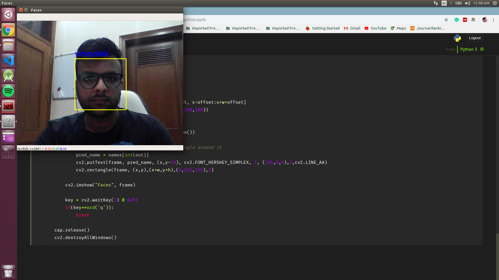

Real Time Face Recognition

In this project you can save facial data of multiple users and then recognize their faces in real time.

How to run:

1. Execute face_data_collect.ipynb and enter the name of the person
2. Allow the script to click multiple pictures of the user.
3. Run face_recognition.ipynb to recognise the saved users in real-time.

